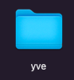
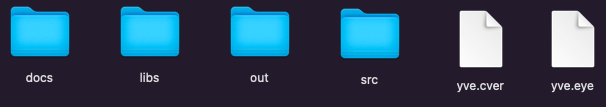

 # Iris environment - 0.0.1

The Iris environment consist of the Iris programming language and various domain specific languages, which have as objective facilitate certain tasks, such as Cornea language, in charge of managing the project configuration, or the Pupil language, similar to Iris but specialised in GPU computing.

It also consists of three console commands: version, create, and compile.

 ## 1. Alphabet

 ### 1.1 Character sets

All the characters specified in this alphabet are conforming to the UTF-8 encoding standard.


 #### 1.1.1 Alpha characters

An alpha character could be any of the following:

``_, A, B, C, D, E, F, G, H, I, J, K, L, M, N, O, P, Q, R, S, T, U, V, W, X, Y, Z, a, b, c, d, e, f, g, h, i, j, k, l, m, n, o, p, q, r, s, t, u, v, w, x, y, z``

 #### 1.1.2 Numeric characters

A numeric character could be any of the following:

``0, 1, 2, 3, 4, 5, 6, 7, 8, 9``

 #### 1.1.3 Alphanumeric characters

An alphanumeric character could be any of the following:

``_, A, B, C, D, E, F, G, H, I, J, K, L, M, N, O, P, Q, R, S, T, U, V, W, X, Y, Z, a, b, c, d, e, f, g, h, i, j, k, l, m, n, o, p, q, r, s, t, u, v, w, x, y, z, 0, 1, 2, 3, 4, 5, 6, 7, 8, 9``

 ### 1.2 Ill-formed

The program is not well formed according to this specification and will output an error

 ### 1.3 DSL

It's the acronym of Domain Specific Language. These are designed to achieve specific tasks, easier.

 ### 1.4 End of sentence

A character(';') that specifies the end of a sentence.

 ### 1.5 Delimiter

A character('.') that acts as a delimiter.

 ### 1.6 Version

A sequence of interleaved delimiters and numeric characters, with an end of sentence character indicating its end.

If just after a delimiter, another delimiter is found, a numeric character '0' will be inserted between both delimiters.

If just after a delimiter, an end of sentence is found, a numeric character '0' will be inserted between both the delimiter and the end of sentence.

 ### 1.7 Measure Unit

Specifies the measurement unit, which is used as the time output unit. Can be one of the following:

```
nanoseconds
microseconds
milliseconds
```

Microseconds is the default measure unit.

 ### 1.8 Set

A collection of non-repeating objects.

 ### 1.9 Natural number, zero-inclusive

The set of positive integer numeric characters, including zero.

 ### 1.10 Natural number, zero-exclusive

The set of positive integer numeric characters, excluding zero.

 ### 1.11 Literal string

A sequence of no characters or UTF-8 characters surrounded by ":

 ``"my_literal_string"``

 ## 2. Version command

The version command is the option to print the version of the running iris compiler.

 ### 2.1 Usage

``version``

 ## 3. Create command

The create command is the option to create the project with the specified name after the '-' character.

If any of the characters of the project name isn't alphanumeric, the program is ill-formed.

If the project name contains only numeric characters, the program is ill-formed.

 ### 3.1 Usage

``create-yve``

This will create the following project folder:




and inside the project folder, the following project structure:



and inside the '.cver' & '.eye' extension file, the following contents:


We will explain the formats of these domain-specific languages later.

If the project folder or any of the items of the project structure couldn't be created, the program is ill-formed.

 ## 4. Compile command

The compile command is the option to compile the project with the specified name after the '-' character.

If any of the characters of the project name isn't alphanumeric, the program is ill-formed.

If the project name contains only numeric characters, the program is ill-formed.

 ### 4.1 Usage

``compile-yve``

This will compile the specified project folder.

If the project folder or any of the items of its project structure is missing, the program is ill-formed.

 ## 5. C-Ver format

The C-Ver DSL has an extension of '.cver', and its main mission is to provide the way to specify the compiler version.

It consists of three keywords:

 1. ``compiler_version``
 2. ``measure``
 3. ``author``

 ### 5.1 Compiler Version

```rust
compiler_version = [Version];
```

It specifies the version of the compiler to use for the compilation process. The compiler version inherently indicates the languages versions.

If the version isn't one of the following, the program is ill-formed:

```rust
0.0.1
```

 #### 5.1.1 Example

```rust
 compiler_version = 0.0.1;
```

 ### 5.2 Measure

```rust
measure = [Measure Unit];
```

It specifies the time measure unit.

If the measure unit isn't a valid measure unit, the program is ill-formed.

 #### 5.2.1 Example

```rust
 measure = milliseconds;
 ```

 ### 5.3 Indentation

```rust
indentation = [Natural number, zero-exclusive];
```

Specifies the indentation space when the character ``\t`` is present.

 #### 5.3.1 Example

```rust
indentation = 4;
```