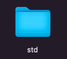

The Iris environment consist of the Iris programming language and various domain specific languages, which have as objective facilitate certain tasks, such as Cornea language, in charge of managing the project configuration, or the Pupil language, similar to Iris but specialised in GPU computing.

It also consists of three console commands: version, create, and compile.

 ## 1. Alphabet

 ### 1.1 Character sets

All the characters specified in this alphabet are conforming to the UTF-8 encoding standard.

 #### 1.1.1 Alpha characters

An alpha character could be any of the following:

``_, A, B, C, D, E, F, G, H, I, J, K, L, M, N, O, P, Q, R, S, T, U, V, W, X, Y, Z, a, b, c, d, e, f, g, h, i, j, k, l, m, n, o, p, q, r, s, t, u, v, w, x, y, z``

 #### 1.1.2 Numeric characters

A numeric character could be any of the following:

``0, 1, 2, 3, 4, 5, 6, 7, 8, 9``

 #### 1.1.3 Alphanumeric characters

An alphanumeric character could be any of the following:

``_, A, B, C, D, E, F, G, H, I, J, K, L, M, N, O, P, Q, R, S, T, U, V, W, X, Y, Z, a, b, c, d, e, f, g, h, i, j, k, l, m, n, o, p, q, r, s, t, u, v, w, x, y, z, 0, 1, 2, 3, 4, 5, 6, 7, 8, 9``

 ### 1.2 Ill-formed

The program is not well formed according to this specification and will output an error

 

 ## 2. Version command

The version command is the option to print the version of the running iris compiler.

 ### 2.1 Usage

``version``

 ## 3. Create command

The create command is the option to create the project with the specified name after the '-' character.

If any of the characters of the project name isn't alphanumeric, the program is ill-formed.

If the project name contains only numeric characters, the program is ill-formed.

 ### 3.1 Usage

``create-std``

This will create the following project folder:

and inside the project folder, the following project structure:

and inside the '.eye' extension file, the following content:

If the project folder or any of the items of the project structure couldn't be created, the program is ill-formed.

 ## 4. Compile command

The compile command is the option to compile the project with the specified name after the '-' character.

If any of the characters of the project name isn't alphanumeric, the program is ill-formed.

If the project name contains only numeric characters, the program is ill-formed.

 ### 4.1 Usage

``compile-std``

This will compile the specified project folder.

If the project folder or any of the items of its project structure is missing, the program is ill-formed.

 ## 5. Front-end pipeline

When a project folder is specified along with the compile command, the 